# Point > Point
## Milestone Project 4:  *full-stack site e-Commerce site.* 

DISCLAIMER: This is a project for Code Institute, to demonstrate an understanding full-stack site based around business logic used to control a centrally-owned dataset.

## Live Project 

[View live project here](https://point-point-1bb0d49f3487.herokuapp.com/)

## Repository 

[Locate project repository here](https://github.com/JJBR13/Justin-Brown-Milestone-Project4)

## Contents 

- [Ideology](#ideology)
- [User Experience](#user-experience)
    + [User Stories](#user-stories)
- [Design](#design)
    + [Wireframes](#wireframes)
    + [Database](#database)
    + [Colour Palette](#colour-pallete)
    + [Typography](#typography)
- [Current Features](#current-features)
    + [Responsive On All Devices](#responsive-on-all-devices)
- [Future Releases](#future-releases)
- [Languages Used](#languages-used)
- [Testing](#testing)
- [Deployment](#deployment)
    + [Project Creation](#project-creation)
    + [Cloning Repo](#cloning-repo)
    + [Danjgo](#django)
    + [ElaphantSQL](#elaphantsql)
    + [Heroku](#heroku)
    + [AWS](#aws)
    + [Stripe](#stripe)
- [References, Credit, Frameworks & Programs](#references-credit-frameworks-programs)
    + [References](#references)
    + [Credit](#credit)
    + [Frameworks](#frameworks)
    + [Programs](#programs)

## Ideology

The purpose of this website is to provide a fully functional e-commerce platform tailored for solo youth travelers seeking their next adventure. Built with Django and Python, the site allows users to explore all the unique travel experiences offered by Point > Point. Visitors can browse destinations, discover the exciting activities awaiting them, and book unforgettable, once-in-a-lifetime trips, all designed specifically for young, solo travelers eager to explore the world. 

## User Experience 

### User Stories 

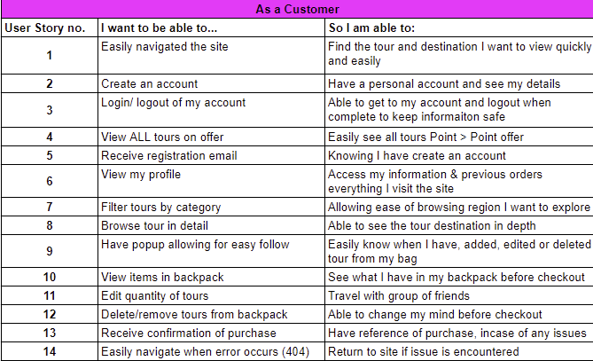

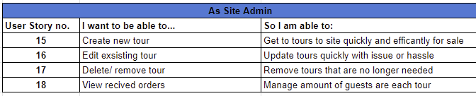

- If the above screenshots are not clear, please follow this [link](https://docs.google.com/spreadsheets/d/1xx5Dkv36HNJfljd7qT-q4SbN8Jt4fcDM39XUS-Ybc3o/edit?usp=drive_link) to google sheet and click tab 'User Stories'. 

## Design 

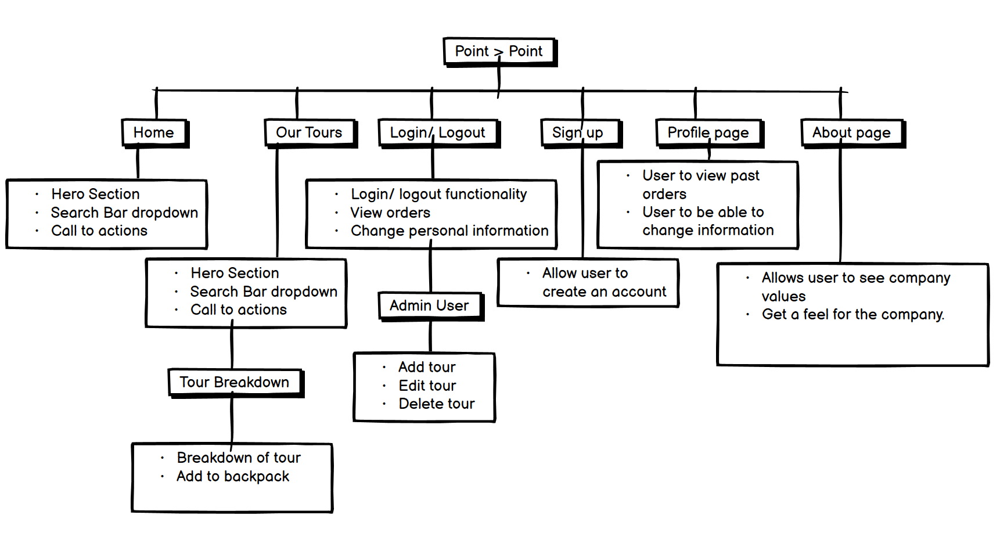
 
### Wireframes

### Database

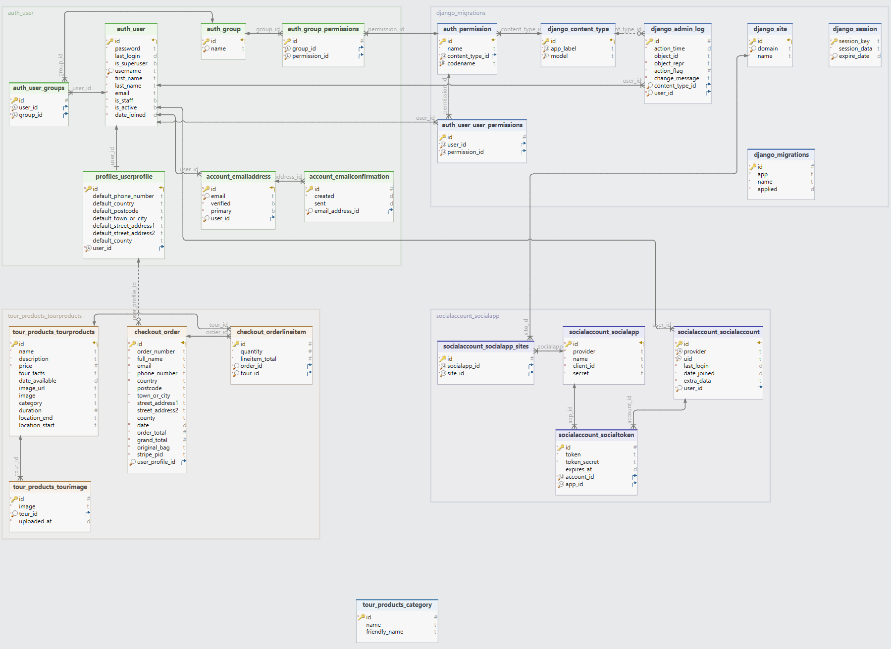

- The relational database for this project is hosted on PostgreSQL. The following data models were used to structure the application:

    - User Profile: Contains user-related information, such as phone number, address, and other personal details.
    - Tour Products: Stores detailed information about the tours offered, including name, description, price, availability, images, and location.
    - Category: Manages the different categories of tours, which can be used to filter and organize the tour products.
    - Order: Keeps track of customer orders, including order number, contact details, shipping address, and the associated user profile.
    - Order Line Items: Holds specific information about each item within an order, such as quantity, price, and the tour product linked to the order.
    - Tour Images: Manages additional images for each tour product, providing more visual information for users.
    - Django and Social Account: Includes tables for user authentication, permissions, and social account integration, supporting features like user login, group permissions, and social media sign-ups.

- The schema was visualized and designed using [DbSchema](https://dbschema.com/download.html): Database Diagram Designer & Management Tool, which helped create a clear and organized representation of the database structure.

### Colour Pallete

### Typography

[Sourced via google fonts](https://fonts.google.com/)

| Header font: Fredoka | Body font: Architects Daughter |
|----------|----------|
|  |  |

## Current Features
### Pages

#### Favicon:

-  A site-wide favicon of the site logo was created, this allows the user to easily identify the site when multiple are open. Helping to achieve user stories:

> i. I want to be able to, easily navigated the site.

#### Navbar

| Navbar | Navbar dropdown example |
|----------|----------|
|  | 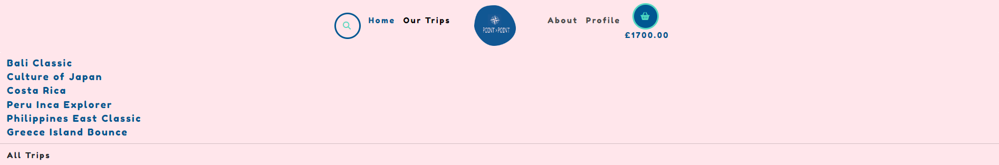 |

- A site-wide navbar is consistently displayed on all pages, featuring a dropdown menu for additional options when the user is logged in. On mobile devices, it collapses into a burger menu, ensuring easy navigation across various devices and meeting user requirements, meeting user stories: 

> i. I want to be able to, easily navigated the site.
> ii. I want to be able to, login/ logout of my account.

#### Home:

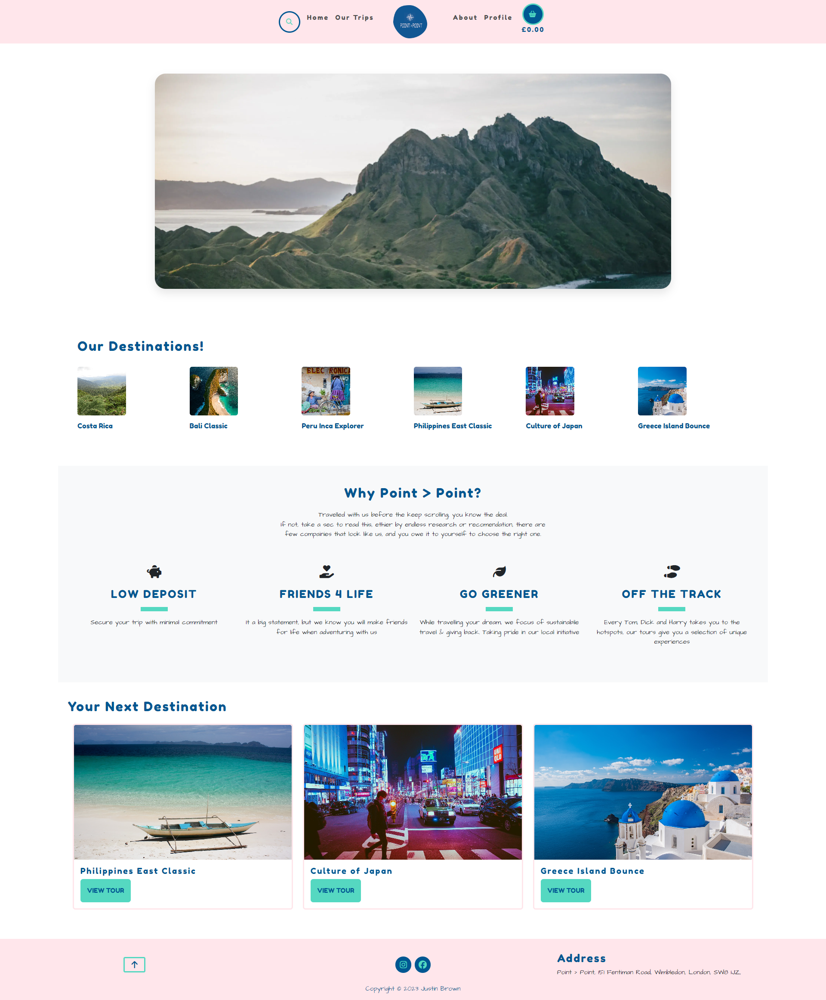

- Upon landing on the site, this is the first page the user sees. Although access is limited, relevant call-to-action buttons are available to help users explore and discover what is on offer.

> i. I want to be able to, easily navigated the site.

#### All Tours:

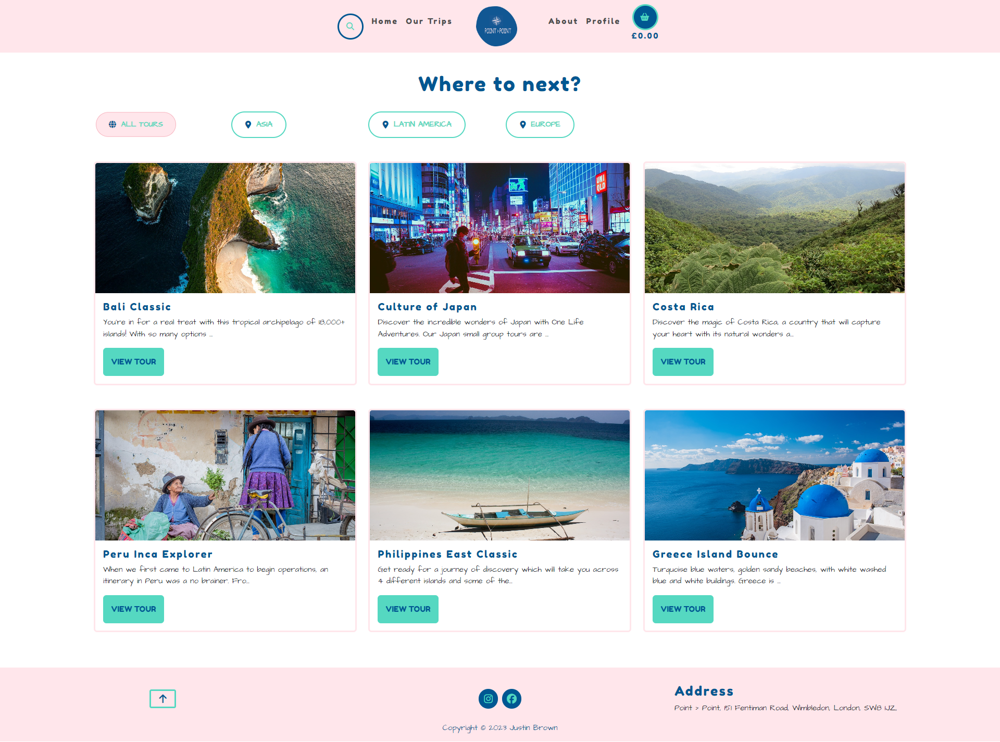

- This page enables users to view all the tours available at Point to Point and filter their search by categories.

> i. I want to be able to, view ALL tours on offer. 
> ii. I want to be able to, filter tours by category. 

#### Tour Breakdown:

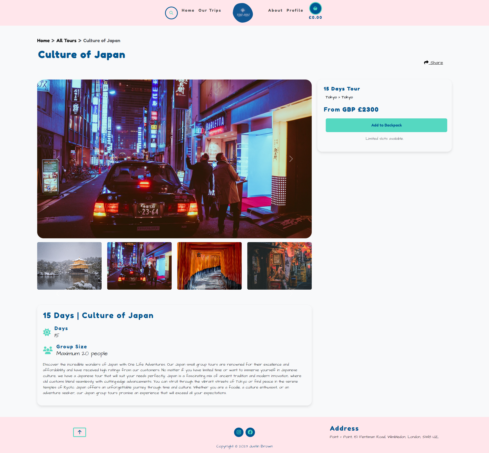

- The tour breakdown provides detailed information and images of the selected tour. Users can add the tour to their backpack before continuing to browse or proceeding to checkout.

> i. I want to be able to, browse tour in detail

#### About:

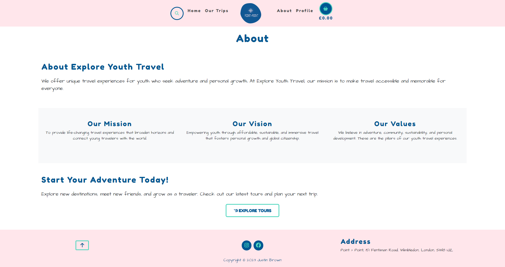

- Also the user to see what the company is about and understand their values. 

#### Login, Logout & Signup:

| Login | Logout | Signup |
|----------|----------|----------|
| 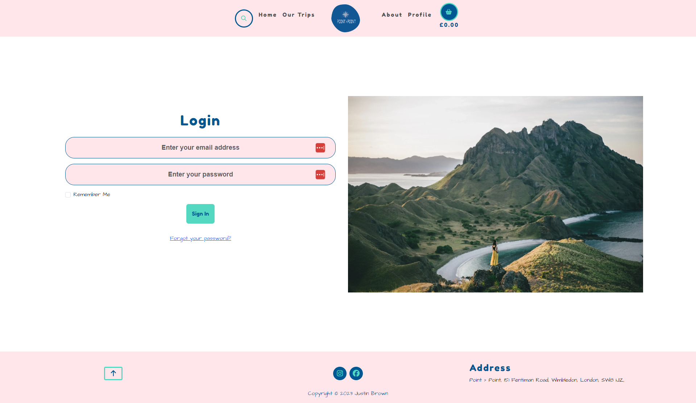 | 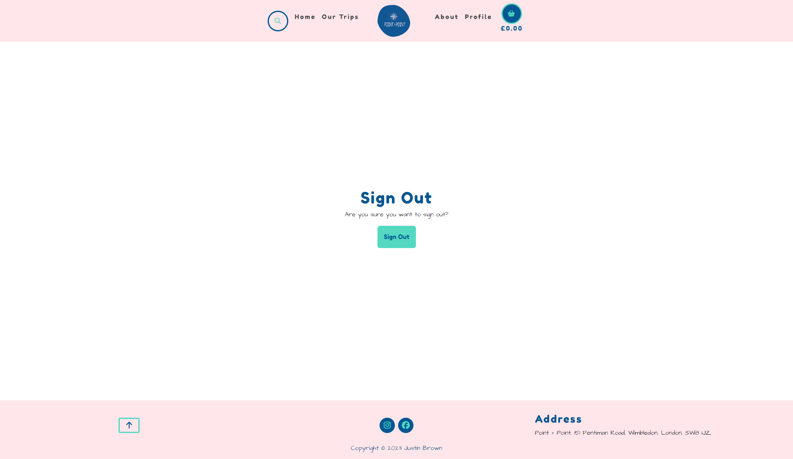 | 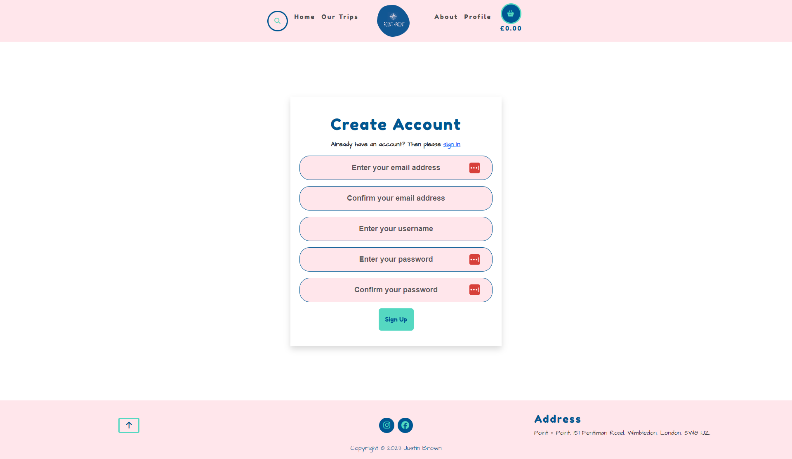 |

- Displays a simple form input, getting the user to fill simple information, and this then gets checked ir uploaded against the database.

> i. I want to be able to, login/ logout of my account 
> ii. I want to be able to, create an account
> iii. I want to be able to, view my profile.

#### Profile & Profile Management:

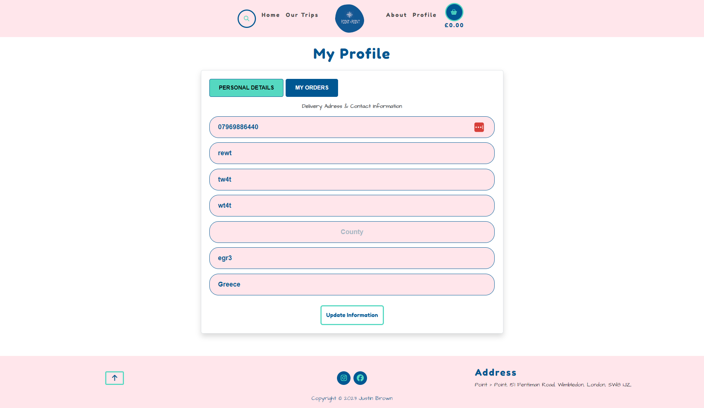

- The profile page allows users to update personal information and view their past orders.

> i. I want to be able to, view my profile.

#### Profile: Admin users 

| Add                                   | Edit                                     | Delete                                   |
|---------------------------------------|------------------------------------------|------------------------------------------|
| 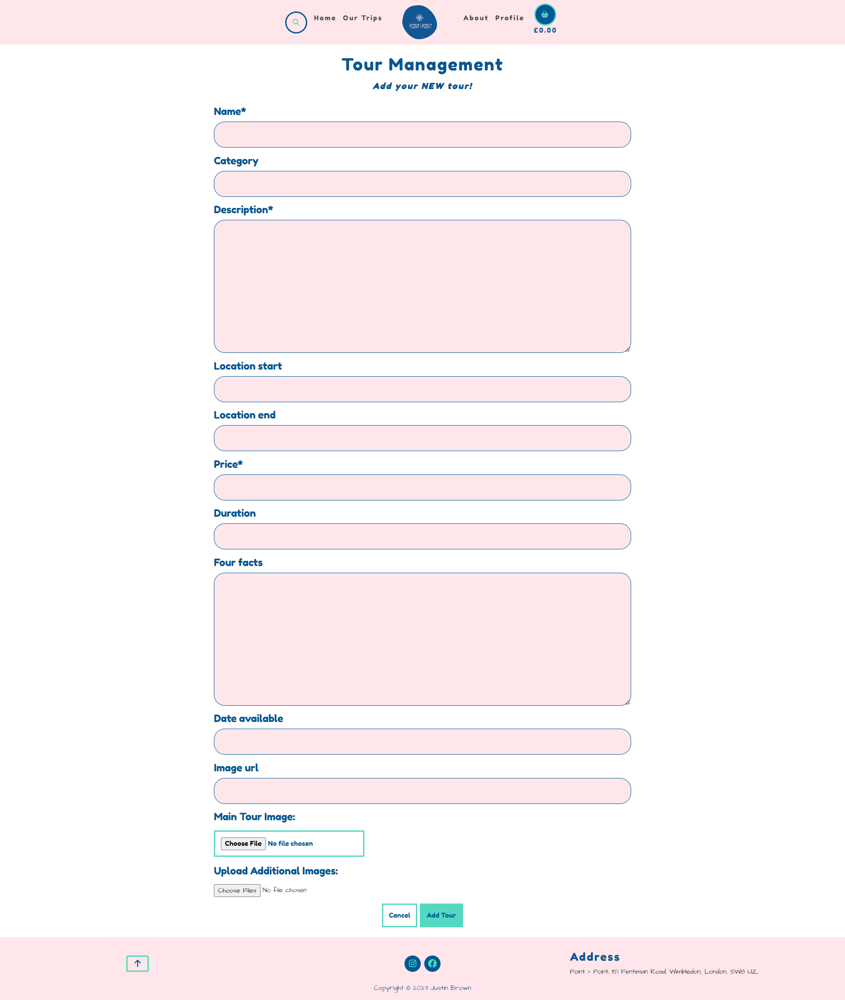 | 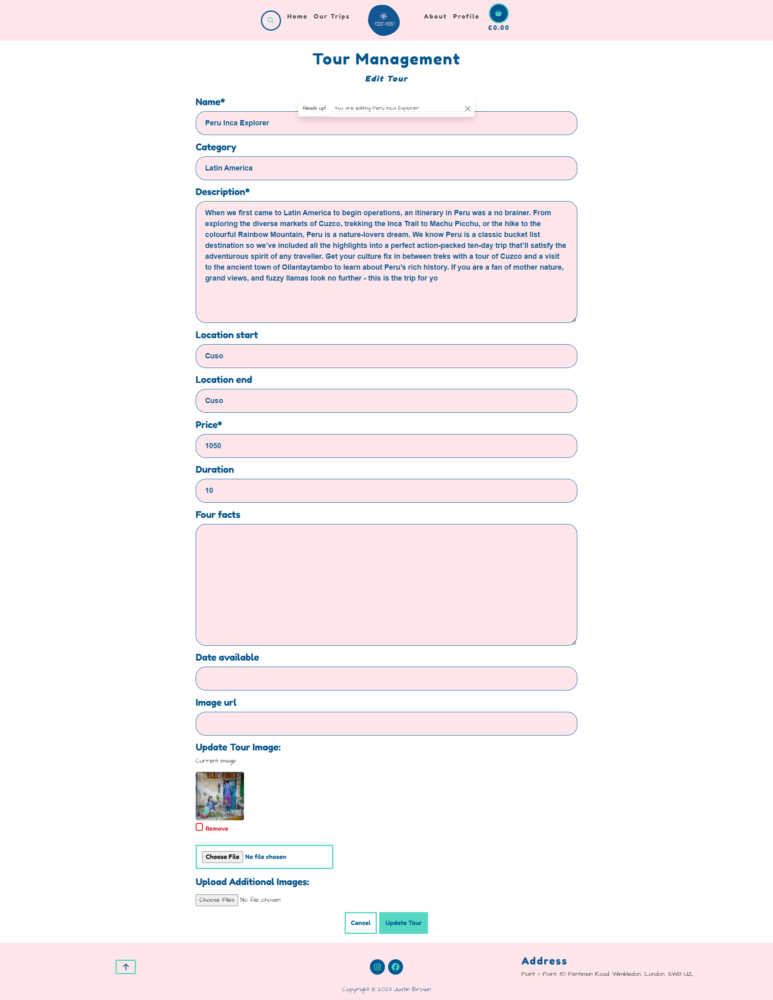 | 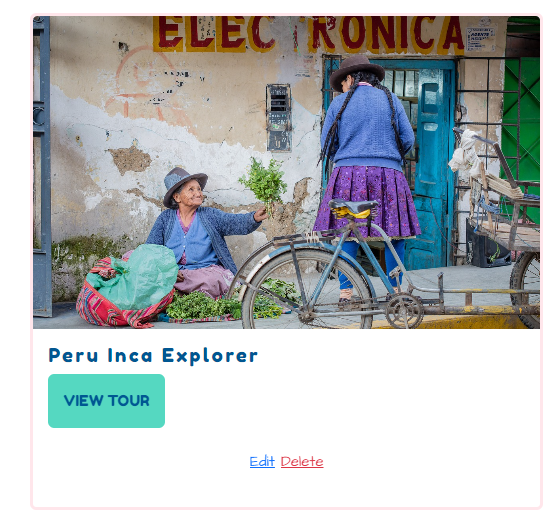 |

- The above functions are available only to admin users, enabling them to efficiently manage tours through add, edit, and delete options.

> i. I want to be able to, create new tour.
> ii. I want to be able to, edit exsisting tour.
> iii. I want to be able to, delete/ remove tour.

#### Backpack:

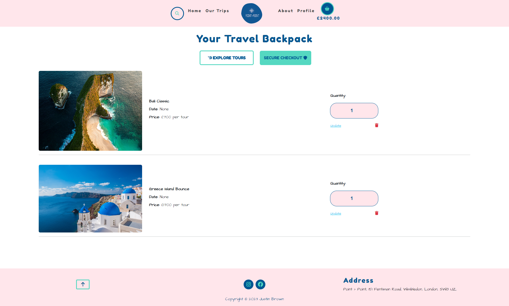

- Here, users can view the tours they wish to purchase. They can adjust the quantity, update, or remove tours they no longer want before proceeding to checkout.

> i. I want to be able to, view items in backpack.
> ii. I want to be able to, edit quantity of tours.
> iii. I want to be able to, delete/remove tours from backpack.

#### Checkout:

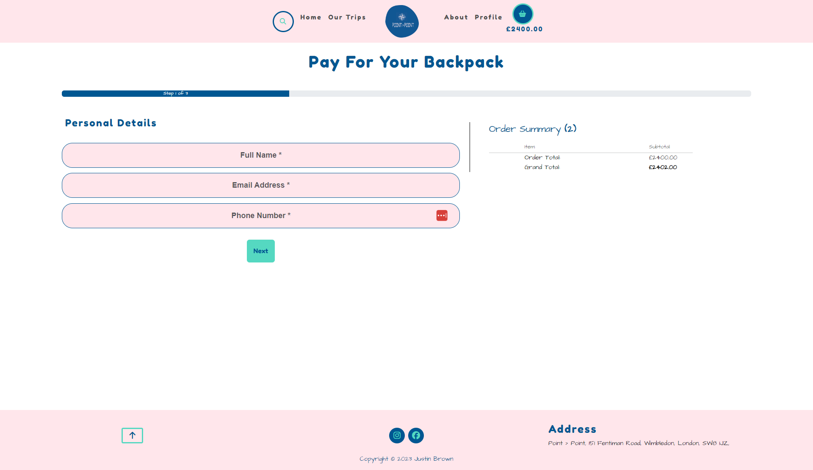

- This is a step-by-step form process with a progress bar above, indicating the user's current stage. Once completed correctly, the user is guided to the checkout.

#### Secure checkout:

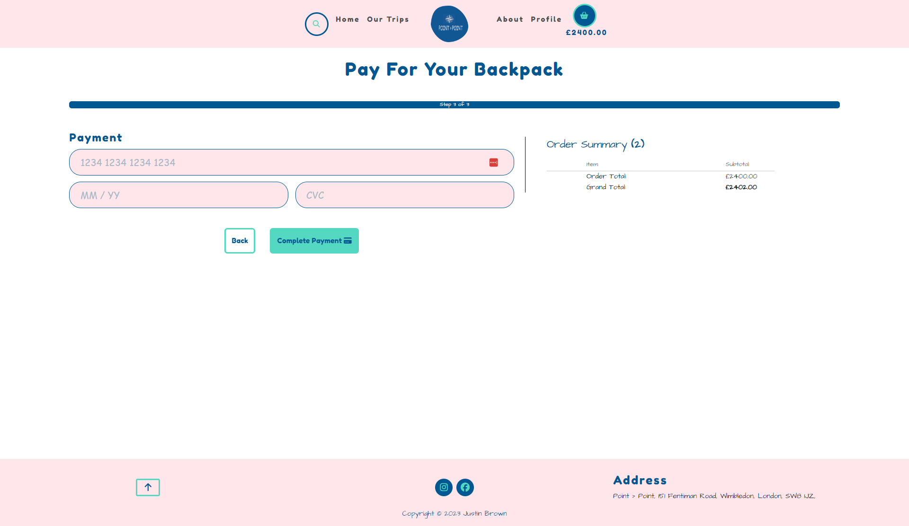

- This page works with Strip API, to provide a secure checkout payment form.

#### Responsive messages:

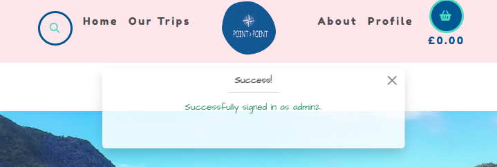

- The messages are sitewide, and pop up to provide feeback to the user. 

> i. I want to be able to, have popup allowing for easy follow.

#### Error Page:

> i. I want to be able to, easily navigate when error occurs (404).

### Responsive On All Devices

## Future Releases

### Live Chat 

- In future development of the app, adding a live chat feature would be beneficial for users to receive real-time support. This could be implemented using the [WhatsApp API](https://pypi.org/project/django-whatsapp-business-api-is/#files)

### Display Images For Admin 

- When an Admin is adding or editing existing tours, having the ability to view the uploaded images or existing images, rather than just their filenames, would provide a more cohesive and efficient administrative experience.

### Checkout Form

- The checkout form is a multi-step form and functions well. However, to enhance usability and security, incorporating the following features would be beneficial: 
    - Enforce a minimum number of digits for the phone number input.
    - Require the email input to include an '@' symbol.
    - Implement a session timeout that automatically logs the user out if they are inactive or have not completed the checkout process within 10 minutes."

### Tour Updates

- In future development, adding tour dates and a 'select date' function to tours would enhance the site's usability. Additionally, incorporating a feature to increase or decrease the quantity of a tour before adding it to the backpack would further improve user experience. 

## Languages Used

- [HTML5](https://www.w3schools.com/whatis/whatis_html.asp)
- [CSS3](https://www.w3schools.com/whatis/whatis_css.asp)
- [JavaScript](https://www.w3schools.com/whatis/whatis_js.asp)
- [Python](https://www.python.org/doc/)

## Testing

- Please see [TEST.md](TEST.md) for a breakdown of website testing and debugging.

## Deployment 

### Project Creation 

#### Cloning Repo 

 1. Locating repository, clicking on the "New" button.
 2. Click the Code button, select clone with HTTPS, SSH or the GitHub CLI and copy the link.
 3. Open the terminal in your preferred IDE. Change the working directory to the target location for the cloned repository.
 4. In the terminal, type 'git clone' followed by the copied URL.
 5. Install the packages from the requirements.txt file by running pip3 install -r requirements.txt in the terminal.

#### Django: 

 1. In the terminal enter, pip3 install 'django<4'.
 2. Then enter, django-admin startproject your project name
 3. You will see the django project folder, including settings.py and urls.py.
 4. Back to the terminal, enter touch .gitignore.
 5. In the .gitignore file enter, *.sqlite3 and *.pyc and pycache
 6. Run the project by entering python3 manage.py runserver to check it is running well. Your page should show a rocket with 'The install worked successfully! Congratulations!' below it.
 7. Back in the terminal CTRL + C to quit the server.
 8. Migrate: enter, python3 manage.py migrate.
 9. Create a superuser: enter, python3 manage.py createsuperuser. Provide username, email (or skip this by hitting enter) and password.

- Adding the Chrome extension "GitPod" created an online coding platform, enabling the use of bash terminals throughout the project. The below "git commands" were used: 

1. git add . - This command for multiple files to the staging area before commiting. 
2. git commit -m "Message explaining upadate" - This command explained changes that were done to the repository. 
3. git push - This command was used to push all committed changes to the GitHub Repository. 

#### ElaphantSQL

 1. Navigate to ElephantSQL.com and select create a new instance.
 2. Select - free database plan.
 3. Set up your plan 
 4. Give it the same name as your project 
 5. Select region closest to you 
 6. Click review and then Create instance.
 7. Return to the ElephantSQL dashboard
 8. Click on the database instance name for this project
 9. In the URL section, copy the database URL to your clipboard

#### Heroku

- Prerequisites:
    1. Ensure that both Git and the Heroku CLI are installed on your local machine.
    2. [Sing up](https://dashboard.heroku.com/) for a Heroku account if you don’t already have one.

 1. Step 1: Create a New App on Heroku
    1. Go to your Heroku Dashboard.
    2. Click the New button and select Create new app.
    3. Enter a unique App Name and choose your preferred Region.
    4. Click the Create app button to proceed.
 2. Step 2: Connect Your App to a GitHub Repository
    1. After creating your app, navigate to the Deploy tab.
    2. In the Deployment Method section, select the GitHub option by clicking on the GitHub logo.
    3. You will be prompted to connect your GitHub account if not already connected.
    4. Search for your GitHub repository by entering its name in the search bar, then click the Search button.
    5. Once your repository appears, click the Connect button next to it.
 3. Step 3: Configure Environment Variables (Config Vars)
    1. Go to the Settings tab of your Heroku app.
    2. In the Config Vars section, click on Reveal Config Vars.
    3. Add the following key-value pairs to configure your environment variables:

            | Key                     | Value                        |
            |-------------------------|------------------------------|
            | `AWS_ACCESS_KEY_ID`     | YOUR_AWS_ACCESS_KEY_ID       |
            | `AWS_SECRET_ACCESS_KEY` | YOUR_AWS_SECRET_ACCESS_KEY   |
            | `DATABASE_URL`          | YOUR_POSTGRES_URL            |
            | `EMAIL_HOST_PASS`       | YOUR_EMAIL_HOST_PASS         |
            | `EMAIL_HOST_USER`       | YOUR_EMAIL_HOST_USER         |
            | `SECRET_KEY`            | YOUR_SECRET_KEY              |
            | `STRIPE_PUBLIC_KEY`     | YOUR_STRIPE_PUBLIC_KEY       |
            | `STRIPE_SECRET_KEY`     | YOUR_STRIPE_SECRET_KEY       |
            | `STRIPE_WH_SECRET`      | YOUR_STRIPE_WH_SECRET        |
            | `USE_AWS`               | TRUE                         |

 4. Step 4: Enable Automatic Deployments
    1. Go back to the Deploy tab.
    2. Scroll down to the Automatic Deploys section.
    3. Choose the branch you want to automatically deploy (usually main or master).
    4. Click on the Enable Automatic Deploys button to activate automatic deployments whenever you push changes to GitHub.
 5. Step 5: Manually Deploy Your Branch
    1. Scroll down to the Manual Deploy section.
    2. Select the branch you want to deploy (again, typically main or master).
    3. Click on the Deploy Branch button.
    4. Heroku will start building and deploying your app. Once completed, you will see a success message.
 6. Step 6: View Your Deployed App
    1. After deployment, click the Open app button at the top right of the Heroku dashboard.
    2. Your app should now be live and accessible at the provided Heroku URL. 

#### AWS

 1. Step 1: Create an S3 Bucket:
    1. Log in to your AWS Management Console.
    2. To access S3:
        - Option 1: Click on the S3 service from the dashboard.
        - Option 2: Type 'S3' into the search bar and select S3.
    3. Click on the Create bucket button.
    4. In the Create bucket form:
        1. Enter a unique Bucket name.
        2. Select ACLs enabled.
        3. Choose Bucket owner preferred for Object Ownership.
        4. Uncheck the Block all public access option.
        5. Check the acknowledgment box to confirm public access.
        6. Leave other settings unchanged and click Create bucket.
 2. Step 2: Enable Static Website Hosting:
    1. Click on the name of the newly created bucket to open its details.
    2. Go to the Properties tab.
    3. Scroll down to the Static website hosting section and click Edit.
    4. In the Static website hosting configuration:
        1. Select Enable.
        2. Enter index.html in the Index document field.
        3. Enter error.html in the Error document field.
        4. Click Save changes.
 3. Step 3: Change CORS Configuration
    1. Go to the Permissions tab of your S3 bucket.
    2. Scroll to the Cross-origin resource sharing (CORS) section and click Edit.
    3. Add the following JSON code in the editor:
        - "[
                {
                    "AllowedHeaders": ["Authorization"],
                    "AllowedMethods": ["GET"],
                    "AllowedOrigins": ["*"],
                    "ExposeHeaders": []
                }
            ]"
    4. Click save changes.
 4. Step 4: Add a Bucket Policy
    1. In the Permissions tab, scroll to the Bucket policy section and click Edit.
    2. Click Policy Generator (opens in a new tab).
    3. In the Policy Generator:
        1. Select S3 Bucket Policy for the policy type.
        2. Enter "*" (without quotes) in the Principal field.
        3. Select GetObject from the Action dropdown.
    4. Copy the ARN from the bucket policy editor in the other tab and paste it into the ARN input field in the Policy Generator.
    5. Click Add Statement.
    6. Scroll down and click Generate Policy.
    7. Copy the generated policy text.
    8. Go back to the bucket policy editor tab and paste the policy text.
    9. Modify the Resource value by adding /* at the end to allow access to all objects:
        - " {
                "Version": "2012-10-17",
                "Id": "Policy1720032710777",
                "Statement": [
                    {
                        "Sid": "Stmt1720024120521",
                        "Effect": "Allow",
                        "Principal": "*",
                        "Action": "s3:GetObject",
                        "Resource": "YOUR_ARN/*"
                    }
                ]
            }
    10. Click Save Changes.
 5. Step 5: Edit the Access Control List (ACL)
    1. In the Permissions tab, scroll down to the Access control list (ACL) section and click Edit.
    2. On the Edit Access control list page:
    3. Under Everyone (public access), check the List box.
    4. Click the checkbox to acknowledge the effects of this change.
    5. Click Save changes.
 6. Step 6: Create a User Group
    1. Go to the AWS Management Console.
    2. Search for IAM in the search bar and click on IAM.
    3. In the IAM dashboard, click on User Groups in the left-hand menu.
    4. Click on the Create group button.
    5. Enter a group name.
    6. Scroll to the bottom and click Create user group.
 7. Step 7: Create a Policy
    1. In the IAM dashboard, click on Policies in the left-hand menu.
    2. Click on Create Policy.
    3. Click the JSON tab to edit the policy in JSON format.
    4. Click the Actions dropdown and select Import managed policy.
    5. In the search bar, type s3 and select AmazonS3FullAccess.
    6. Click Import Policy.
    7. Open a new tab and go to the S3 service.
        1. Select your bucket.
        2. Click on the Copy ARN button to copy the ARN of your bucket.
    8. Go back to the policy editor tab and add your ARN to the Resource list twice:
        - First, add it as "arn:aws:s3:::your-bucket-name".
        - Second, add it as "arn:aws:s3:::your-bucket-name/*" to grant access to all objects.
        - Policys should look like this: 
            - " {
                    "Version": "2012-10-17",
                    "Statement": [
                        {
                            "Sid": "Statement1",
                            "Effect": "Allow",
                            "Action": [
                                "s3:*"
                            ],
                            "Resource": [
                                "arn:aws:s3:::your-bucket-name",
                                "arn:aws:s3:::your-bucket-name/*"
                            ]
                        }
                    ]
                } "
    9. Click Next at the bottom of the page.
    10. Enter a policy name and description.
    11. Click Create policy.
    12. You will see a success message indicating that the policy has been created.
 8. Step 8: Attach the Policy to the Group
    1. Go to the User groups section in the IAM dashboard.
    2. Click on the group you created
    3. Go to the Permissions tab and click the Add permissions dropdown.
    4. Select Attach policies.
    5. Search for the policy you created by name or description.
    6. Check the box next to your policy and click Attach policies.
 9. Step 9: Create a User
    1. In the IAM dashboard, click on Users in the left-hand menu.
    2. Click on Create user.
    3. Enter a user name and click Next.
    4. Select the user group you created previously and click Next.
    5. Scroll down and click Create user.
 10. Step 10: Create an Access Key
    1. Click on the new user you created.
    2. Go to the Security credentials tab.
    3. Scroll down to the Access keys section and click Create access key.
    4. Select Application running outside AWS and click Next.
    5. Click Create access key.
    6. Click on Download .csv file to save the access key information.
    7. Click Done.
    8. Open the .csv file in a text editor. It will contain your AWS_ACCESS_KEY_ID and AWS_SECRET_ACCESS_KEY.
    9. Use these values to set environment variables for your Heroku application

#### Stripe
 1. Navigate to Stripe website 
 2. Register for a Stripe account.
 3. Go to 'API Keys' to view public and secret key.
 4. In the apps .env file, add STRIPE_PUCLIC_KEY AND STRIPE_SECERET_KEY.
 5. Copy in public and secret keys from Stripe.
 6. Go to Heroku and open the app.
 7. Click 'settings' and 'Reveal Config Vars'
 8. Add the STRIPE_PUCLIC_KEY AND STRIPE_SECERET_KEY with their keys from Stripe.

## References, Credit, Frameworks & Programs

### References 

- [Django Secret Key](https://djecrety.ir/):
    - Used to generate django secret key.

- [Flat icon](https://www.flaticon.com/): 
    - All icons used for the site.

- [Git](https://git-scm.com/): 
    - Used for version conterol.

- [GitHub](https://docs.github.com/en/get-started): 
    - Was used to store the project.

- [Google Chrome Developer Tools](https://developer.chrome.com/docs/devtools/): 
    - Used to inspect site pages and there elements to help debug issues with layouts and try differnt CSS styles.
    
- [Google Fonts](https://fonts.google.com/) 
    - Used to import fonts into style.css. 

- [Hex to RGBA Converter](https://rgbacolorpicker.com/)
    - Used to convert hex to rgba.

- [Loading Animation](https://css-loaders.com/classic/): 
    - Loading animation while payment is pending.

- [Images for tours](https://pixabay.com/): 
    - Image content for tours.

- [One Life Adventures](https://onelifeadventures.com/): 
    - Tour names & description.

- [Profile tab structure](https://codepen.io/rockteam/pen/WrpXBN ): 
    - Used on profile page to create tab for perosnal details & Order history. 

- [Trutravels](https://www.trutravels.com/): 
    - Tour names & description.

- [Unicorn Revealer](https://chromewebstore.google.com/detail/unicorn-revealer/lmlkphhdlngaicolpmaakfmhplagoaln?hl=en-US&utm_source=ext_sidebar): 
    - Used to aid with diagnosis & applying css.

### Credit

- [Boutique Ado](https://github.com/Code-Institute-Solutions/boutique_ado_v1/tree/f5880efee43b3b9ea1276a09ca972f4588001c59)
    - A lot of the core code was taken from the 'Boutique Ado' walkthrough project on Code Institute.

- [Code Institute](https://codeinstitute.net/): 
    - For all the lecture/ learning content provided. 

- [Manu at Bristol Collge](https://codeinstitute.net/): 
    - For all the support and pointers. 

### Frameworks

- [Bootstrap](https://getbootstrap.com/)
    - Documentation and layout of the site.

- [Heroku](https://id.heroku.com/login): 
    - Used as hosting platform to deploy the project.

### Programs 

- [Balsamiq](https://balsamiq.com/)
   - Allowed the creation of wireframes.

- [Canva](https://www.canva.com/login)
   - Allowed the creation logos & Unquie sitewide touches.
