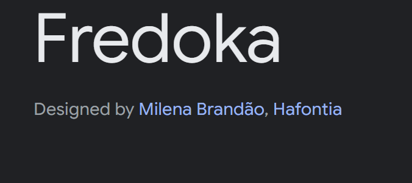

# Point > Point
## Milestone Project 4:  *full-stack site e-Commerce site.* 

DISCLAIMER: This is a project for Code Institute, to demonstrate an understanding full-stack site based around business logic used to control a centrally-owned dataset.

## Live Project 

[View live project here](#)

## Repository 

[Locate project repository here](https://github.com/JJBR13/Justin-Brown-Milestone-Project4)

## Contents 

- [Ideology](#ideology)
- [User Experience](#user-experience)
    + [User Stories](#user-stories)
- [Design](#design)
    + [Wireframes](#wireframes)
    + [Database](#database)
    + [Colour Palette](#colour-pallete)
    + [Typography](#typography)
- [Current Features](#current-features)
    + [Responsive On All Devices](#responsive-on-all-devices)
- [Future Releases](#future-releases)
- [Languages Used](#languages-used)
- [Testing](#testing)
- [Deployment](#deployment)
    + [Project Creation](#project-creation)
    + [Cloning Repo](#cloning-repo)
    + [Danjgo](#django)
    + [ElaphantSQL](#elaphantsql)
    + [Heroku](#heroku)
    + [Stripe](#stripe)
- [References, Credit, Frameworks & Programs](#references-credit-frameworks-programs)
    + [References](#references)
    + [Credit](#credit)
    + [Frameworks](#frameworks)
    + [Programs](#programs)

## Ideology

The purpose of this website is to provide a fully functional e-commerce platform tailored for solo youth travelers seeking their next adventure. Built with Django and Python, the site allows users to explore all the unique travel experiences offered by Point > Point. Visitors can browse destinations, discover the exciting activities awaiting them, and book unforgettable, once-in-a-lifetime trips, all designed specifically for young, solo travelers eager to explore the world. 

## User Experience 

### User Stories 

- If the above screenshots are not clear, please follow this [link](https://docs.google.com/spreadsheets/d/1xx5Dkv36HNJfljd7qT-q4SbN8Jt4fcDM39XUS-Ybc3o/edit?usp=drive_link) to google sheet and click tab 'User Stories'. 

## Design 

 
### Wireframes

### Database

### Colour Pallete

### Typography

[Sourced via google fonts](https://fonts.google.com/)

| Header font: Fredoka | Body font: Architects Daughter |
|----------|----------|
|  |  |

## Current Features
### Pages

#### Favicon:

-  A site-wide favicon of the site logo was created, this allows the user to easily identify the site when multiple are open. Helping to achieve user stories:

> i. I want to be able to, easily navigated the site.

#### Navbar

| Navbar | Navbar dropdown example |
|----------|----------|
|  |  |

- A site-wide navbar is consistently displayed on all pages, featuring a dropdown menu for additional options when the user is logged in. On mobile devices, it collapses into a burger menu, ensuring easy navigation across various devices and meeting user requirements, meeting user stories: 

> i. I want to be able to, easily navigated the site.
> ii. I want to be able to, login/ logout of my account.

#### Home:

- Upon landing on the site, this is the first page the user sees. Although access is limited, relevant call-to-action buttons are available to help users explore and discover what is on offer.

> i. I want to be able to, easily navigated the site.

#### All Tours:

- This page enables users to view all the tours available at Point to Point and filter their search by categories.

> i. I want to be able to, view ALL tours on offer. 
> ii. I want to be able to, filter tours by category. 

#### Tour Breakdown:

- The tour breakdown provides detailed information and images of the selected tour. Users can add the tour to their backpack before continuing to browse or proceeding to checkout.

> i. I want to be able to, browse tour in detail

#### About:

- Also the user to see what the company is about and understand their values. 

#### Login, Logout & Signup:

| Login | Logout | Signup |
|----------|----------|----------|
|  |  |  |

- Displays a simple form input, getting the user to fill simple information, and this then gets checked ir uploaded against the database.

> i. I want to be able to, login/ logout of my account 
> ii. I want to be able to, create an account
> iii. I want to be able to, view my profile.

#### Profile & Profile Management:

- The profile page allows users to update personal information and view their past orders.

> i. I want to be able to, view my profile.

#### Profile: Admin users 

| Add                                   | Edit                                     | Delete                                   |
|---------------------------------------|------------------------------------------|------------------------------------------|
|  |  |  |

- The above functions are available only to admin users, enabling them to efficiently manage tours through add, edit, and delete options.

> i. I want to be able to, create new tour.
> ii. I want to be able to, edit exsisting tour.
> iii. I want to be able to, delete/ remove tour.

#### Backpack:

- Here, users can view the tours they wish to purchase. They can adjust the quantity, update, or remove tours they no longer want before proceeding to checkout.

> i. I want to be able to, view items in backpack.
> ii. I want to be able to, edit quantity of tours.
> iii. I want to be able to, delete/remove tours from backpack.

#### Checkout:

- This is a step-by-step form process with a progress bar above, indicating the user's current stage. Once completed correctly, the user is guided to the checkout.

#### Secure checkout:

- This page works with Strip API, to provide a secure checkout payment form.

#### Responsive messages:

- The messages are sitewide, and pop up to provide feeback to the user. 

> i. I want to be able to, have popup allowing for easy follow.

#### Error Page:

> i. I want to be able to, easily navigate when error occurs (404).

### Responsive On All Devices

## Future Releases

### Live Chat 

- In future development of the app, adding a live chat feature would be beneficial for users to receive real-time support. This could be implemented using the [WhatsApp API](https://pypi.org/project/django-whatsapp-business-api-is/#files)

### Display Images For Admin 

- When an Admin is adding or editing existing tours, having the ability to view the uploaded images or existing images, rather than just their filenames, would provide a more cohesive and efficient administrative experience.

### Checkout Form

- The checkout form is a multi-step form and functions well. However, to enhance usability and security, incorporating the following features would be beneficial: 
    - Enforce a minimum number of digits for the phone number input.
    - Require the email input to include an '@' symbol.
    - Implement a session timeout that automatically logs the user out if they are inactive or have not completed the checkout process within 10 minutes."

### Tour Updates

- In future development, adding tour dates and a 'select date' function to tours would enhance the site's usability. Additionally, incorporating a feature to increase or decrease the quantity of a tour before adding it to the backpack would further improve user experience. 

## Languages Used

- [HTML5](https://www.w3schools.com/whatis/whatis_html.asp)
- [CSS3](https://www.w3schools.com/whatis/whatis_css.asp)
- [JavaScript](https://www.w3schools.com/whatis/whatis_js.asp)
- [Python](https://www.python.org/doc/)

## Testing

- Please see [TEST.md](TEST.md) for a breakdown of website testing and debugging.

## Deployment 

### Project Creation 

#### Cloning Repo 

 1. Locating repository, clicking on the "New" button.
 2. Click the Code button, select clone with HTTPS, SSH or the GitHub CLI and copy the link.
 3. Open the terminal in your preferred IDE. Change the working directory to the target location for the cloned repository.
 4. In the terminal, type 'git clone' followed by the copied URL.
 5. Install the packages from the requirements.txt file by running pip3 install -r requirements.txt in the terminal.

#### Django: 

 1. In the terminal enter, pip3 install 'django<4'.
 2. Then enter, django-admin startproject your project name
 3. You will see the django project folder, including settings.py and urls.py.
 4. Back to the terminal, enter touch .gitignore.
 5. In the .gitignore file enter, *.sqlite3 and *.pyc and pycache
 6. Run the project by entering python3 manage.py runserver to check it is running well. Your page should show a rocket with 'The install worked successfully! Congratulations!' below it.
 7. Back in the terminal CTRL + C to quit the server.
 8. Migrate: enter, python3 manage.py migrate.
 9. Create a superuser: enter, python3 manage.py createsuperuser. Provide username, email (or skip this by hitting enter) and password.

- Adding the Chrome extension "GitPod" created an online coding platform, enabling the use of bash terminals throughout the project. The below "git commands" were used: 

1. git add . - This command for multiple files to the staging area before commiting. 
2. git commit -m "Message explaining upadate" - This command explained changes that were done to the repository. 
3. git push - This command was used to push all committed changes to the GitHub Repository. 

#### ElaphantSQL
 1. Navigate to ElephantSQL.com and select create a new instance.
 2. Select - free database plan.
 3. Set up your plan 
 4. Give it the same name as your project 
 5. Select region closest to you 
 6. Click review and then Create instance.
 7. Return to the ElephantSQL dashboard
 8. Click on the database instance name for this project
 9. In the URL section, copy the database URL to your clipboard

#### Heroku

#### Stripe
 1. Navigate to Stripe website 
 2. Register for a Stripe account.
 3. Go to 'API Keys' to view public and secret key.
 4. In the apps .env file, add STRIPE_PUCLIC_KEY AND STRIPE_SECERET_KEY.
 5. Copy in public and secret keys from Stripe.
 6. Go to Heroku and open the app.
 7. Click 'settings' and 'Reveal Config Vars'
 8. Add the STRIPE_PUCLIC_KEY AND STRIPE_SECERET_KEY with their keys from Stripe.

## References, Credit, Frameworks & Programs

### References 

- [Flat icon](https://www.flaticon.com/): 
    - All icons used for the site.

- [Git](https://git-scm.com/): 
    - Used for version conterol.

- [GitHub](https://docs.github.com/en/get-started): 
    - Was used to store the project.

- [Google Chrome Developer Tools](https://developer.chrome.com/docs/devtools/): 
    - Used to inspect site pages and there elements to help debug issues with layouts and try differnt CSS styles.
    
- [Google Fonts](https://fonts.google.com/) 
    - Used to import fonts into style.css. 

- [Hex to RGBA Converter](https://rgbacolorpicker.com/)
    - Used to convert hex to rgba.

- [Loading Animation](https://css-loaders.com/classic/): 
    - Loading animation while payment is pending.

- [Images for tours](https://pixabay.com/): 
    - Image content for tours.

- [One Life Adventures](https://onelifeadventures.com/): 
    - Tour names & description.

- [Profile tab structure](https://codepen.io/rockteam/pen/WrpXBN ): 
    - Used on profile page to create tab for perosnal details & Order history. 

- [Trutravels](https://www.trutravels.com/): 
    - Tour names & description.

- [Unicorn Revealer](https://chromewebstore.google.com/detail/unicorn-revealer/lmlkphhdlngaicolpmaakfmhplagoaln?hl=en-US&utm_source=ext_sidebar): 
    - Used to aid with diagnosis & applying css.

### Credit

- [Boutique Ado](https://github.com/Code-Institute-Solutions/boutique_ado_v1/tree/f5880efee43b3b9ea1276a09ca972f4588001c59)
    - A lot of the core code was taken from the 'Boutique Ado' walkthrough project on Code Institute.

- [Code Institute](https://codeinstitute.net/): 
    - For all the lecture/ learning content provided. 

- [Manu at Bristol Collge](https://codeinstitute.net/): 
    - For all the support and pointers. 

### Frameworks

- [Bootstrap](https://getbootstrap.com/)
    - Documentation and layout of the site.

- [Heroku](https://id.heroku.com/login): 
    - Used as hosting platform to deploy the project.

### Programs 

- [Balsamiq](https://balsamiq.com/)
   - Allowed the creation of wireframes.

- [Canva](https://www.canva.com/login)
   - Allowed the creation logos & Unquie sitewide touches.
