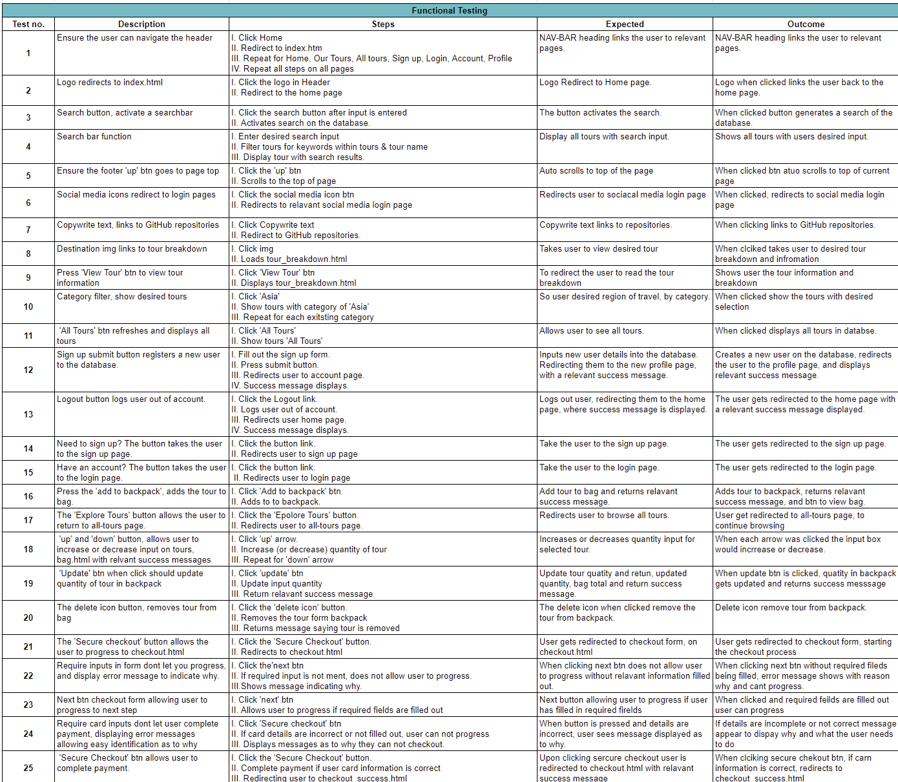
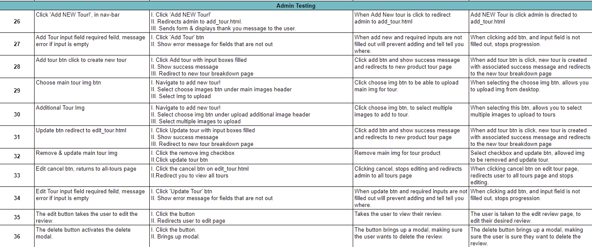

# Testing 

Testing was done site-wide, all tests undertaken are shown below: 

## Contents 

- [Functional Testing](#functional-testing)
- [Stripe](#stripe)
- [WAVE](#wave)
- [Validator Testing](#validator-testing)
  + [HTML](#html)
  + [CSS](#CSS)
  + [JavaScript](#javascript)
  + [PEP8](#pep8-online)
- [Lighthouse](#lighthouse)
  + [Desktop Results](#desktop-results)
  + [Mobile Results](#mobile-results)
- [Colour Contrast](#colour-contrast)
- [Browser Compatibility](#browser-compatibility)
- [Responsivity](#responsivity)
- [Issues/ Bugs Found & Resolved](#issues-bugs-found-resolved)

## Functional Testing 

Please follow this [link](https://docs.google.com/spreadsheets/d/1xx5Dkv36HNJfljd7qT-q4SbN8Jt4fcDM39XUS-Ybc3o/edit?usp=drive_link) to spreadsheet of all functional testing carried out, click the Testing tab if the screenshots are not clear.

## Stripe

### Dummy Card Information

The following test card details were used for testing Stripe:

Card Number: 4242 4242 4242 4242
Date: 04/42
CVC: 242
Postcode: 42424