# Testing 

Testing was done site-wide, all tests undertaken are shown below: 

## Contents 

- [Functional Testing](#functional-testing)
- [WAVE](#wave)
- [Validator Testing](#validator-testing)
  + [HTML](#html)
  + [CSS](#CSS)
  + [JavaScript](#javascript)
  + [PEP8](#pep8-online)
  + [Flake8](#flake8)
- [Lighthouse](#lighthouse)
  + [Desktop Results](#desktop-results)
  + [Mobile Results](#mobile-results)
- [Browser Compatibility](#browser-compatibility)
- [Responsivity](#responsivity)
- [Stripe](#stripe)
  + [Dummy Card Information](#dummy-card-information)
- [Issues/ Bugs Found, Resolved & Unresolved](#issues-bugs-found-resolved--unresolved)

## Functional Testing 

Please follow this [link](https://docs.google.com/spreadsheets/d/1xx5Dkv36HNJfljd7qT-q4SbN8Jt4fcDM39XUS-Ybc3o/edit?usp=drive_link) to spreadsheet of all functional testing carried out, click the Testing tab if the screenshots are not clear.

## WAVE

- I used the Chrome WAVE extension site-wide to thoroughly test and evaluate various accessibility aspects of my website. The tool was particularly helpful in identifying key areas related to structure, color contrast, and semantic organization. WAVE provided valuable insights into how well my site adhered to accessibility standards, highlighting elements that required adjustments, such as improving contrast ratios for better readability and ensuring a clear and logical structure for assistive technologies. This comprehensive analysis allowed me to make informed decisions to enhance the user experience and accessibility of my site.

## Validator Testing

### HTML

[W3C HTML Validator link](https://validator.w3.org/)

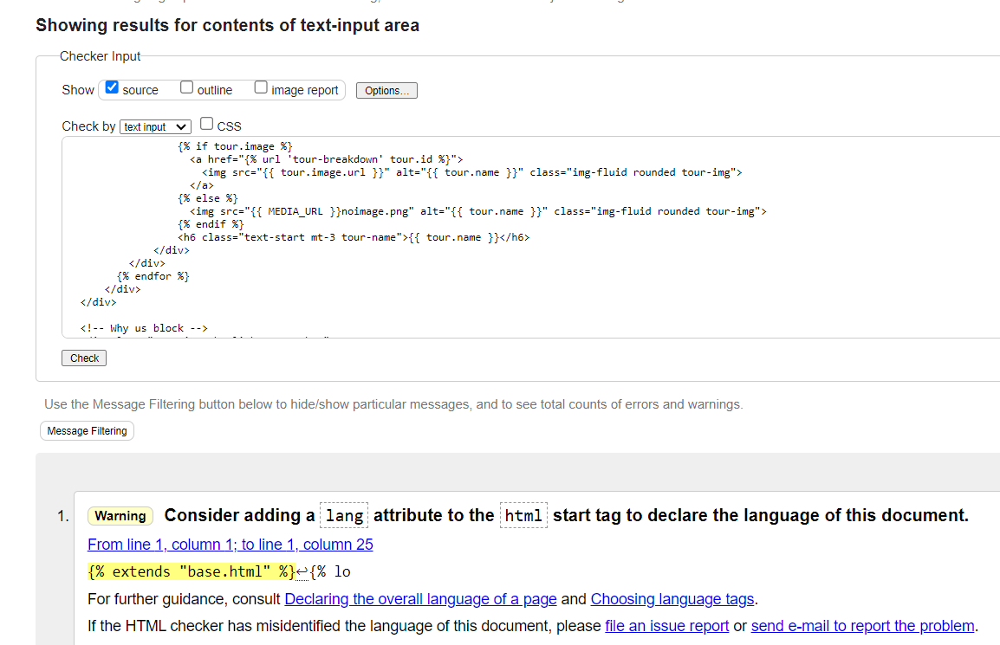

- All HTML files were manually validated using the W3C validator to check for errors. The results were interpreted with some flexibility, as the integration of other languages like Python triggered warnings and errors that were not directly related to the HTML structure.

### CSS

[W3C CSS Validator link](https://jigsaw.w3.org/css-validator/#validate_by_input+with_options)

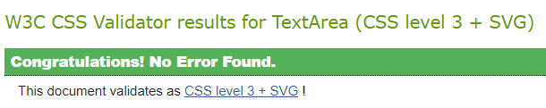

- All project app static CSS files were manually entered and tested. Each file passed successfully, with only a few warnings identified. These warnings were primarily due to the use of frameworks like Bootstrap.

### JavaScript

[JSHint](https://jshint.com/)

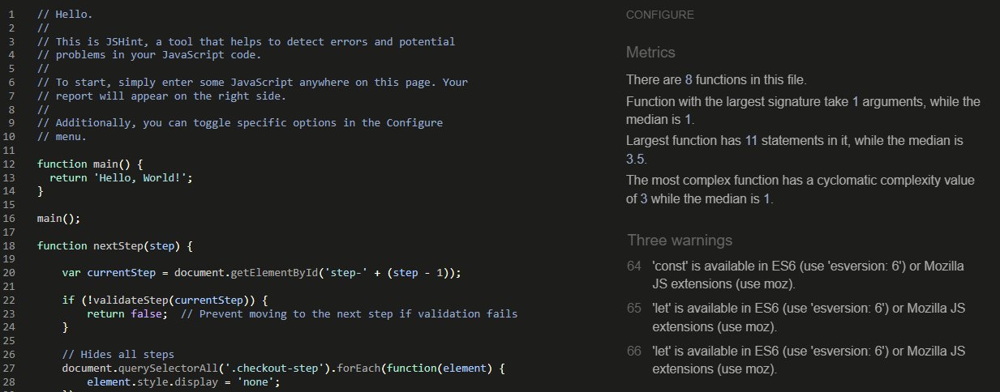

- JS Hint was used not only to test all JavaScript files, but also throughout the project to troubleshoot and resolve issues in my JavaScript code.

### PEP8

[PEP8](http://ww7.pep8online.com/)

- This validation tested python code, in the app.py and was used throughout the development giving key indications of what was not compliant and the reason for this. This helped keep the code clean and readable throughout the development.

### Flake8 

- Flake8 was utilised to validate the Python codebase, revealing several issues such as inconsistent indentation, trailing whitespace, missing blank lines, and lines exceeding the maximum length limit. Most of these issues, including indentation, whitespace, and blank line errors, were resolved. However, the excessively long lines in migration files, as well as a few other instances of long lines, were deferred for future resolution to avoid disrupting critical code functionality.

## Ligthouse

[Lighthouse](https://developer.chrome.com/docs/lighthouse/)

Lighthouse, a powerful Chrome DevTools feature, provided invaluable insights into the functionality, layout, and overall readability of my site. It allowed me to evaluate key aspects such as performance, accessibility, and best practices, ensuring a seamless and engaging user experience. By analyzing the site’s structure and styles, Lighthouse highlighted areas where the layout could be optimized for various screen sizes, helping to create a responsive design that looks great on all devices.

### Desktop Results

Below table summarizes the Lighthouse results for key pages on the site, providing a visual reference for each test.

| Page              | Lighthouse Result                                                                 |
|-------------------|-----------------------------------------------------------------------------------|
| **Home**          | 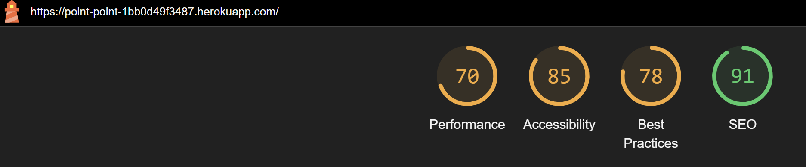              |
| **All Tours**     | 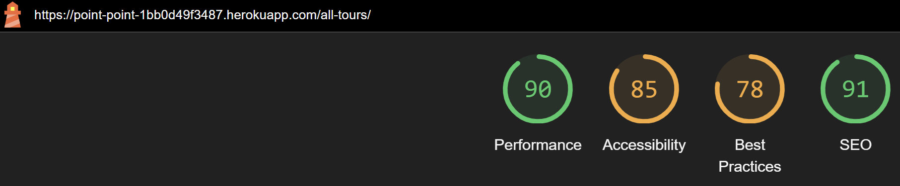    |
| **Tour Breakdown**| 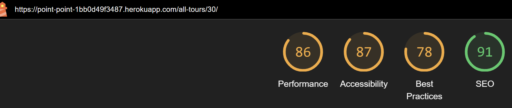 |
| **Profile**       | 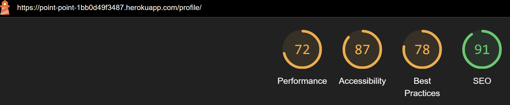        |
| **Login**         | 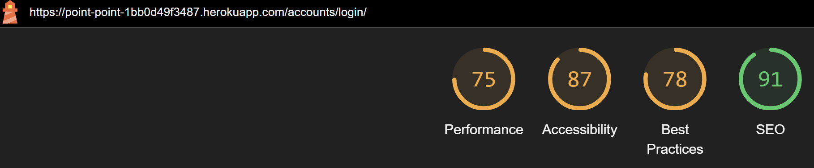            |
| **Sign Up**       | 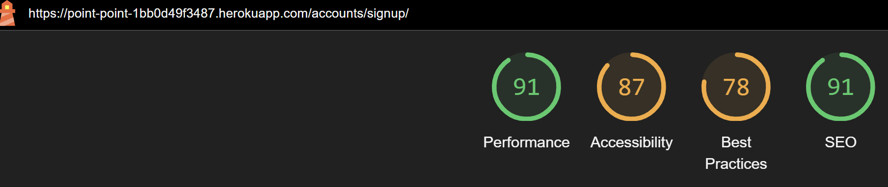         |

### Mobile Results

Below table summarizes the Lighthouse results for key pages on the site, providing a visual reference for each test.

| Page              | Lighthouse Result                                                                 |
|-------------------|-----------------------------------------------------------------------------------|
| **Home**          | 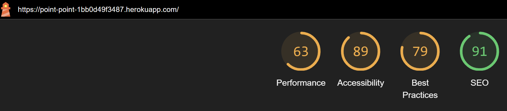              |
| **All Tours**     | 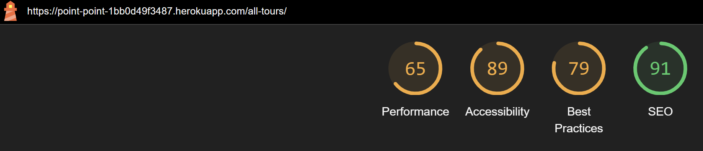    |
| **Tour Breakdown**| 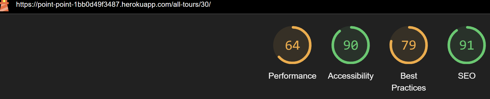 |
| **Profile**       | 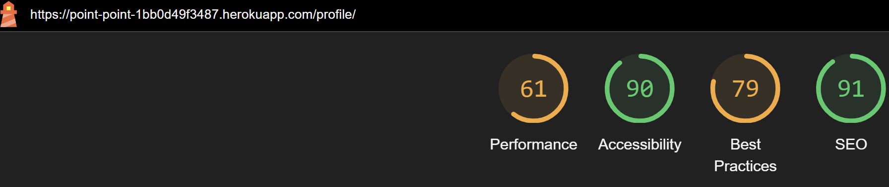        |
| **Login**         | 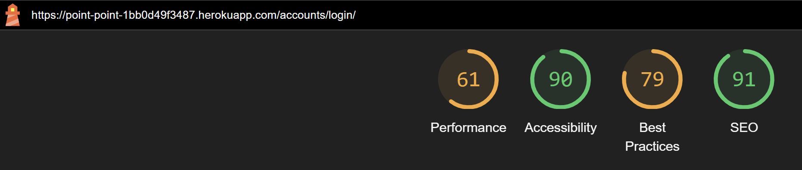            |
| **Sign Up**       | 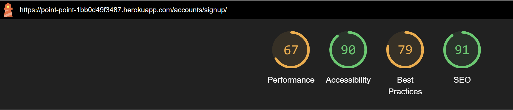        |

- We can see in both desktop and mobile devices that there is still work to me done and can work furth on the imporovements light house have indicated.

## Responsivity

- Point > Point, is made easily accessible on all devices with help from the Materialize framework. Test through Google Developer Tools, on devices: 
    - iPhone SE
    - iPhone XR
    - Pixel 5
    - Samsung S8+
    - iPad Mini
    - iPad Air 
    - iPad Pro
    - Surface Duo

- The site was also tested for full responsive functionality manually on the below devices: 
    - Asus Zenbook
    - Google Pixel 7 pro
    - ASUS ZenScreen (portable screen)
    - Macbook Pro

## Stripe
### Dummy Card Information

The following test card details were used for testing Stripe:

  | **Field**    | **Value**              |
  |--------------|------------------------|
  | **Card Number** | 4242 4242 4242 4242   |
  | **Date**     | 04/42                  |
  | **CVC**      | 242                    |
  | **Postcode** | 42424                  |

## Issues/ Bugs Found, Resolved & Unresolved